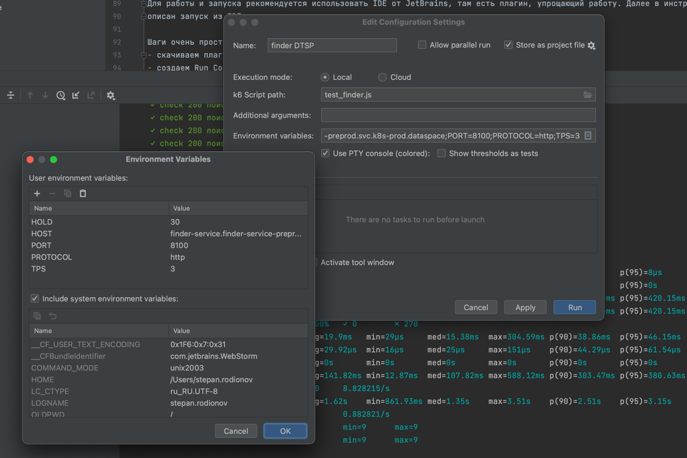
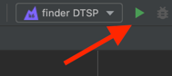
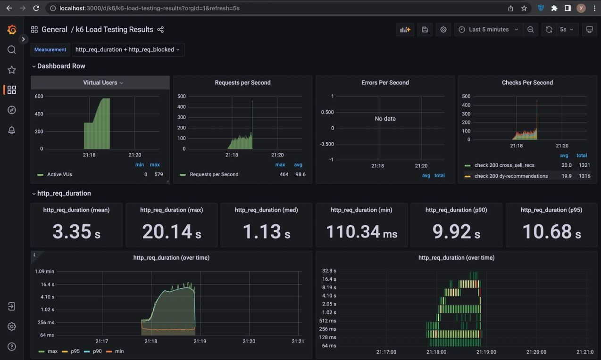
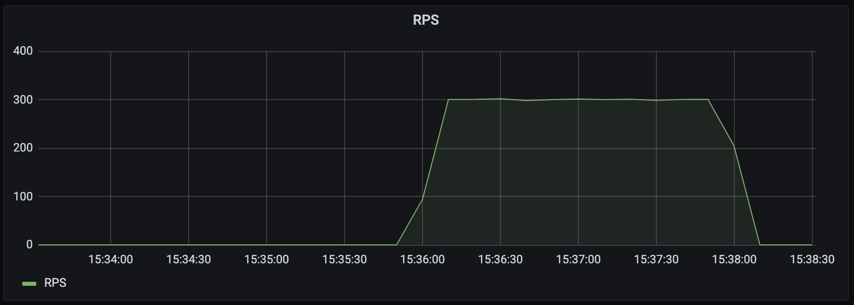
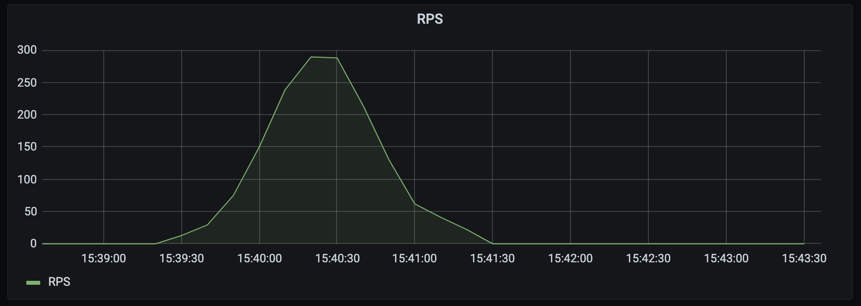
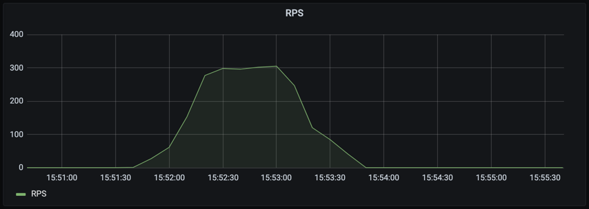
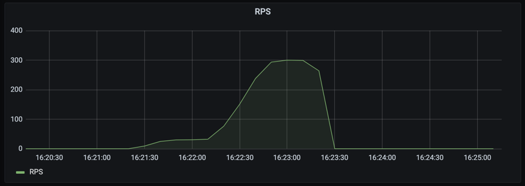

# k6

Описание инструмента

## Запуск

Описание запуска в pipeline проекта

### Запуск локально

Данный инструмент можно запускать локально!
Для этого необходимо сначала установить k6. Сделать это просто: идем на страницу https://k6.io/docs/getting-started/installation/
и следуем короткой инструкции.

Далее запускать нагрузочные тесты можно с помощью команды k6. Подробное описание по команде - `k6 --help`

### Запуск с помощью плагина в IDE

Для работы и запуска рекомендуется использовать IDE от JetBrains, там есть плагин, упрощающий работу. Далее в инструкции будет описан запуск из IDE.

Шаги очень простые:
- скачиваем плагин для работы с k6 и включаем его
- создаем Run Configuration в верхнем правом углу окна IDE
- настраиваем требуемые параметры: опции, ENV переменные, путь к скрипту
- жмем Run! В консоли вы увидите вывод утилиты и финальную статистику

Можно не настраивать профили с нуля, а использовать пресеты, которые есть в папке `.run.example` . Чтобы они стали доступны
в окошке конфигураций, необходимо скопировать их в папку .run

Вот так выглядит настройка для локального запуска:


После того как настроили, выбираем сценарий в выпадашке и жмем Run



> Запускать в IDE получится только базовый k6, собранное с расширениями запустить не выйдет

### Запуск с помощью Makefile
Тестирование можно запустить и с помощью Makefile:

- выставить необходимые env параметры в файле .env (или скопировать из .env.example)
- выполнить скрипт в консоли `make your_script`,

### Запуск в Docker
- выставить необходимые env параметры в файле .env (или скопировать из .env.example)
- выполнить скрипт в консоли `docker-compose run k6 run /scripts/sample.js`

### Вывести данные в графане
- поднять графану с influxfb `docker-compose -d influxdb grafana`
- выставить env параметр `K6_OUT=influxdb=http://influxdb:8086/k6`
- выполнить скрипт:
    - локальный запуск `k6 run --out=influxdb=http://localhost:8086/k6 ./sample.js`
    - запуск через докер`docker-compose run k6 run /scripts/sample.js`
    - запуск через конфигурацию *.xml установить опцию `<option name="additionalParams" value="--out=influxdb=http://localhost:8086/k6" />`
    - используя makefile любую команду с префиксом `dc`, например `dcui`
- Открыть в браузере http://localhost:3000/d/k6/k6-load-testing-results?orgId=1&refresh=5s
  

### Запуск с отчетом в облаке

Можно запустить k6, отправив отчет в облако, чтобы смотреть красивые картинки вместо сухих цифр. Для этого необходимо следующее:
- зарегистрироваться вот здесь: https://app.k6.io/account/login
- получить токен
- авторизоваться в k6 с помощью токена (можно из консоли, можно в окошке плагина)
- добавить в опции запуска `--out cloud`

Впрочем в бесплатной версии есть серьезные ограничения, которые не позволяют сделать такой сценарий сколько-нибудь эффективным,
так что вы вряд ли захотите запускать тестирование в облаке

## Профили нагрузки

Данный инструмент поддерживает большое количество профилей нагрузки. В официальной документации
можно найти множество примеров как можно запускать тестирование.
Однако для удобства пользователей, в репозитории настроены базовые сценарии для запуска.

Примечание: все сценарии были запущены с параметрами HOLD=120 и TPS=300

### Линейный

Генерирует константное количество запросов в секунду, которое будет указано в настройке TPS
на протяжении всей работы скрипта.
Может быть опасно применять на больших RPS: приложение не успевает отмасштабироваться и погибает.

Задается через ENV TYPE=linear



### Кривая нормального распределения

Выдает классический "колокол" нормального распределения, достигая максимума запросов в пике

Задается через ENV TYPE=curve



### Кривая распределения с плато

Является разновидностью нормального распределения, только в отличие от базового сценария
примерно треть времени скрипт работает на максимальном RPS

Задается через ENV TYPE=curve_flat



### Плавное нарастание

Скрипт постепенно разгоняется до максимальной производительности и
на последней своей трети работает на максимальных RPS

Задается через ENV TYPE=increasing



### Подключение профиля в скрипт нагруза

Делается двумя строчками кода на JS:
```javascript
const scenarioFun = determineScenario(__ENV.TYPE)
const scenario = scenarioFun(maxVus, tps, duration)
```

### Создание своих профилей нагрузки

Вы всегда можете разрабатывать свои сценарии. Для этого можно использовать как код,
который есть в этом репозитории (см содержимое файла scenarios.js и curveDistribution()),
так и базовые возможности k6 - https://k6.io/docs/using-k6/scenarios/executors/

## Написание своих расширений

### Вводные

Для разработки своих расширений (плагинов) необходимо установить инструмент [xk6](https://github.com/grafana/xk6). 
Это легко сделать, пользуясь официальной документацией. После чего вы сможете собирать бинарник k6 с внешними модулями или своим собственным.

Подробнее вот тут: https://k6.io/docs/extensions/guides/build-a-k6-binary-with-extensions/

> Если у вас возникают проблемы с запуском xk6, выполните в терминале `export PATH=$PATH:$(go env GOPATH)/bin`. 
> Также необходимо включить модули go - `export GO111MODULE="on"`, а еще в проекте созданы файлы go.mod и load.go, без них не запускается
> 
> Вполне возможно, что все шаги выше нафиг не нужны при грамотной настройке

Пример плагина можно найти в папке ./plugins/demo . Пример сборки с локальным модулем demo и внешним модулем sql в Makefile. 
Там же пример запуска локально собранного бинарника

### Как писать свои плагины?

TODO - рекомендации по написанию своих модулей.
Пример кода модуля от k6 - https://github.com/grafana/xk6-sql/blob/master/sql.go

### Как работать с образами в pipeline

Собираем image при помощи Dockerfile из проекта, результатом запуска которого будет образ с готовым бинарником, содержащим оба этих плагина. 
Образ необходимо запушить в registry. Пример действий:

```bash
docker build .
# writing image sha256:8f958d901369be800cb7dcad2752129d5a5ac47c0bd737be6d2d7f196ea98093
docker tag 8f958d901369 registry.ru/namespace/project:tag
docker push registry.ru/namespace/project:tag
```

Сейчас этот образ можно получить в hub.docker.com как [rodionoff/xk6:^0.9](https://hub.docker.com/r/rodionoff/xk6)

Что необходимо сделать дальше:
- добавить стадию сборки образа в pipeline
- пушить образ в registry вашей организации
- скачивать его на стадии запуска нагруза и запускать на нем


## Шаги по разработке сценария нагрузочного тестирования

Пишем скрипт на языке JS. В целом сценарий нагрузочного тестирования делится на 2 части:

### Настройка

В этой фазе происходит настройка параметров скрипта. Настраивать сценарий удобнее всего с применением ENV переменных. 
Обрабатываем их, задаем опции запуска (https://k6.io/docs/using-k6/k6-options/how-to/) , 
создаем [сценарий](https://k6.io/docs/using-k6/scenarios/) с необходимым нам [профилем нагрузки](#профили-нагрузки) . 
Можем дополнительно настроить [thresholds](https://k6.io/docs/using-k6/thresholds/) для качественной оценки результата.

Если мы генерируем запросы с высокой вариативностью, то определяем функцию, которая будет создавать патроны, 
даем ей аргументы, которые мы будем использовать для подстановки и параметризации. 
Для того, чтобы подбрасывать параметры в генератор было удобнее, можно складывать их в файлы и подключать файлы в скрипте

Можно объявить функции setup и teardown. Первая выполнится перед началом выполнения сценариев, вторая - после того как они отработают.
Они отработают по одному разу вне зависимости от количества сценариев


### Сценарий тестирования

Наконец мы дошли до самого сценария тестирования. Он должен находиться внутри функции объявленной как default. 
Этот сценарий описывает поведение виртуального юзера и является "сессией". 
Внутри сессии вашего виртуального пользователя может быть сколько угодно много запросов.

> **Обратите внимание!**
> 
> Если вы хотите получить конкретное количество запросов на сервис, не забудьте, что k6 оперирует виртуальными пользователями (vu). 
> Таким образом, если в теле функции default 3 запроса на ваш сервис и за весь тест вы хотите сделать ровно N запросов, 
> нужно будет сделать ровно N / 3 итераций

Также все функции (setup, teardown, default) необходимо экспортировать.

### Пример болванки скрипта:

```javascript
// Здесь происходит настройка сценария
export const options = {
    scenarios: {
        scenario_1: {
          executor: 'shared-iterations',
          vus: 2,
          iterations: 10,
        },
    }
}

// Здесь можем объявлять пользовательские функции, которые понадобятся в сценарии

// Получаем данные из файла ./data/products.csv, можем использовать их далее в скрипте
const products_ids = new SharedArray("товары по id", function () {
  return papaparse.parse(open('./data/products.csv'), {header: false}).data;
}).map(val => {
  return Number(val[0]);
});

export function setup() {
    // функция которая должна выполниться перед стартом сценария
}

export default function (data) {
    // сценарий пользователя
}

export function teardown(data) {
    // функция которая должна выполниться по завершению сценария
}
```